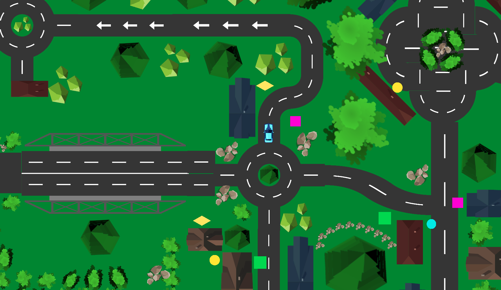

My First Unity 2D game.
# Delivery Drive

## About The Game
Delivery Drive is a 2D top-down view driving game where players navigate a small town, delivering packages to various destinations. The game features an intricately designed town complete with roads, rocks, streets, trees, and houses. The objective is to deliver packages as quickly and efficiently as possible, overcoming various obstacles and challenges along the way.

## Features
- **Engaging Gameplay:** Navigate through a beautifully crafted small town, delivering packages to designated locations.
- **Challenges and Obstacles:** Avoid obstacles like rocks and trees and maneuver through narrow streets to reach your destination.
- **Interactive Environment:** Explore the dynamic environment with interactive elements like traffic and pedestrians.
- **Time-Based Scoring:** Deliver packages as fast as you can to score higher points.

## Getting Started
To get started with Delivery Drive:

1. **Clone the Repository:**  
   `git clone https://github.com/kevinYang0612/delivery-drive.git`

2. **Open the Project in Unity:**  
   Launch Unity Hub, click on 'Add' and browse to the cloned repository folder. Open the project in your Unity Editor.

3. **Run the Game:**  
   Once the project is open in Unity, go to the `Scenes` folder and open the main scene. Press the 'Play' button in the Unity Editor to start the game.

## Controls
- **Arrow Keys/WASD:** Use to steer the vehicle.
- **Spacebar:** Use to brake.

## Built With
- [Unity](https://unity.com/) - The game engine used
- [Visual Studio](https://visualstudio.microsoft.com/) - IDE for development

Initial load

Driving around the town

Delivering

## Contributing
Contributions to Delivery Drive are welcome! Please read our [Contributing Guidelines](CONTRIBUTING.md) for details on our code of conduct and the process for submitting pull requests to us.

## Authors
- **Kevin Yang** - *Initial work* - [kevinYang0612](https://github.com/kevinYang0612)

## Acknowledgments
- Hat tip to anyone whose code was used
- Inspiration
- etc